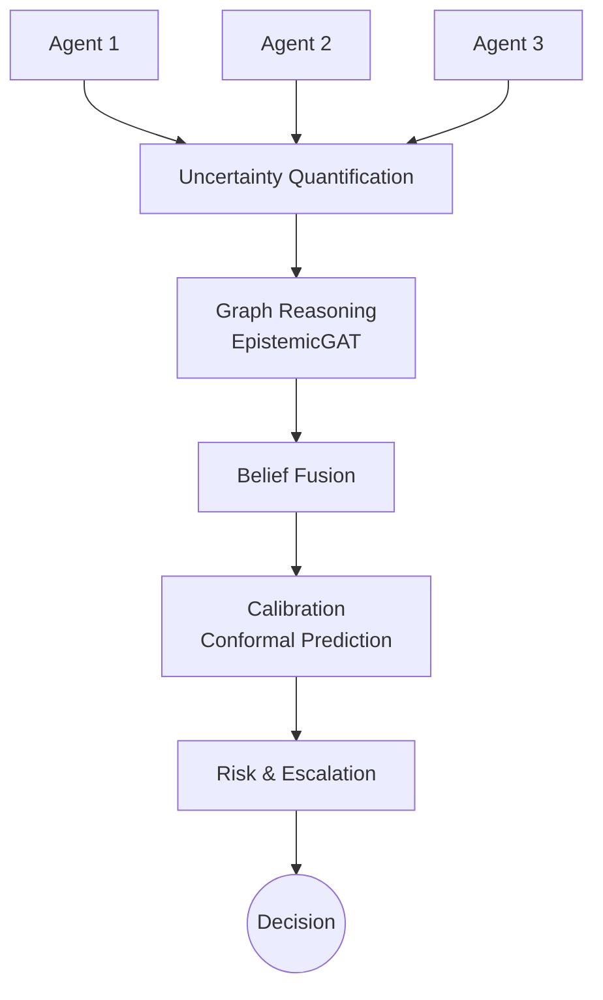

# Concepts & Architecture

COGNIX is built to model the exact lifecycle of an uncertain prediction in a multi-agent system.

## 1. Multiple Agents
The system assumes you have $N$ agents (e.g., sensors on a vehicle, diagnostic models in a hospital). These agents operate independently but are trying to predict the same underlying state.

## 2. Predictions + Uncertainty
A standard AI system returns a prediction (e.g., "75% confident it is a pedestrian"). COGNIX requires the model to also report its **uncertainty**. We strictly separate:
- **Aleatoric Uncertainty**: Inherent data noise (e.g., blurry camera).
- **Epistemic Uncertainty**: Model ignorance (e.g., never seen snow before).

## 3. Graph Reasoning
The agents are often physically or logically related (e.g., a Front Camera is positioned near a Front LiDAR). We map them into a graph. COGNIX passes the predictions through a Graph Neural Network (GNN).
Crucially, using `EpistemicGAT`, COGNIX injects the *epistemic uncertainty* as a prior. If the Front Camera has high epistemic uncertainty (due to snow), the network dynamically severs its influence on the rest of the graph.

## 4. Belief Fusion
After graph processing, the distinct agent beliefs must be merged into a single system-level belief. `EpistemicWeightedFusion` achieves this by weighting each agent's contribution inversely proportional to their epistemic uncertainty.

## 5. Calibration
Machine learning models are notoriously overconfident. COGNIX applies post-hoc **Temperature Scaling** to smooth probabilities, and **Conformal Prediction** to generate sets of predictions (e.g., `{Pedestrian, Bicycle}`) that are guaranteed to contain the truth with a specific probability (e.g., 90%).

## 6. Decision & Escalation
Finally, a Risk Assessor looks at the fused, calibrated probability distribution. The `EscalationEngine` steps in if:
- Confidence is too low.
- Total uncertainty is too high.
- The conformal prediction set is too large (indicating confusion).

If any of these trigger, the system outputs an `ESCALATE` signal, allowing a human operator to intervene before a catastrophic failure occurs.
