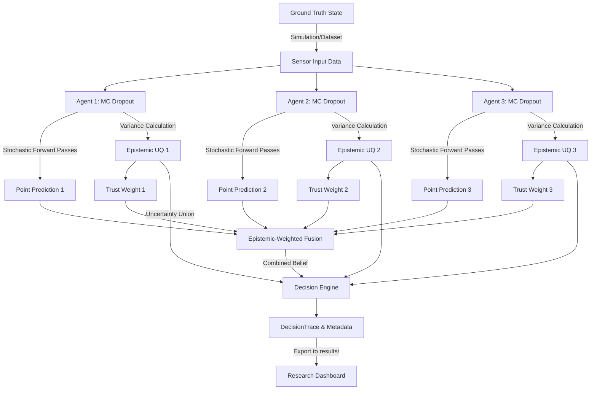

# COGNIX Runtime Data Flow

To ensure strict scientific integrity, COGNIX enforces a unidirectional data flow where no metrics are artificially generated. Every number displayed in the dashboard or reported in a paper is traceably computed from the step before it.

## Guarantees
1. **No Synthetic Overrides**: Uncertainty is derived exclusively from the mathematical variance of the underlying PyTorch models (MC Dropout) or Deep Ensembles.
2. **Immutable Provenance**: The resulting `DecisionTrace` records the exact seed, run ID, and configuration parameters that produced it.
3. **Trace Playback**: The dashboard operates exclusively by reading generated `DecisionTrace` JSON logs. It no longer contains internal "demo mode" signal generators.
